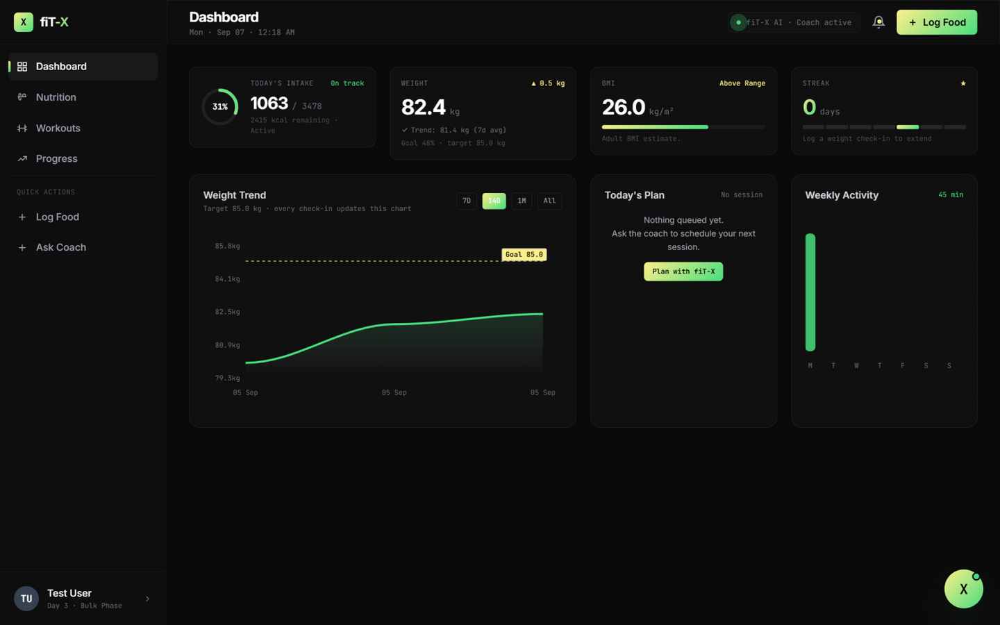
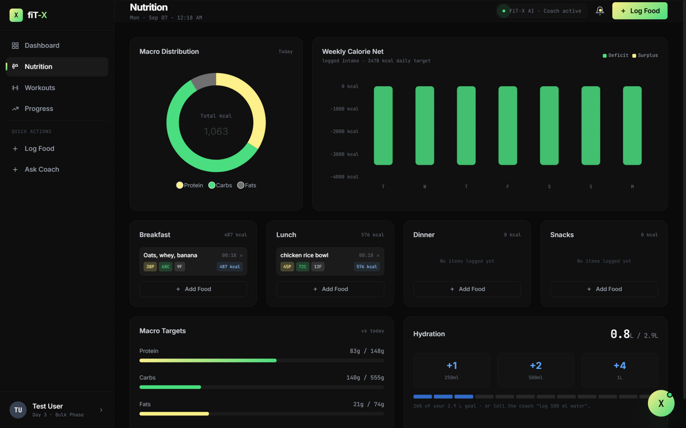
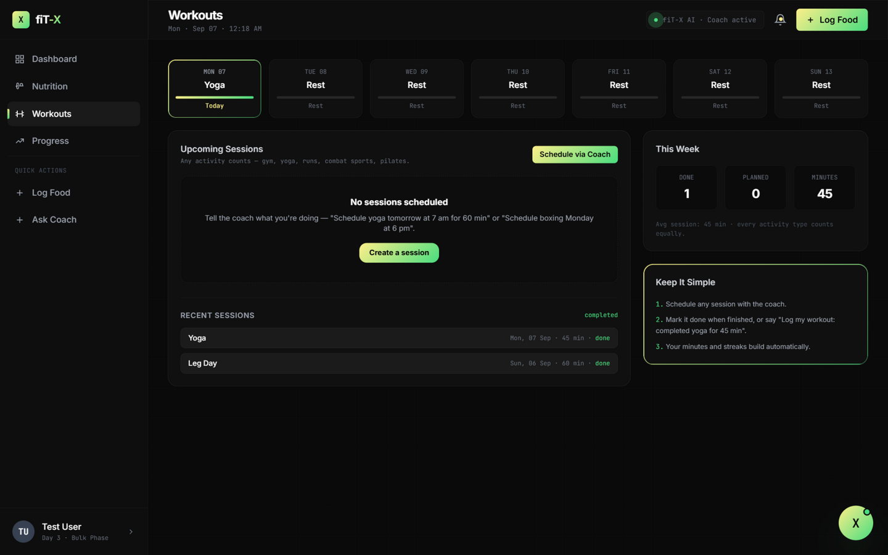
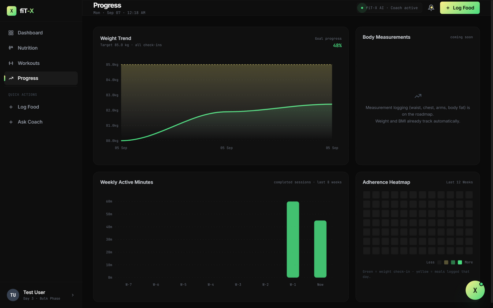
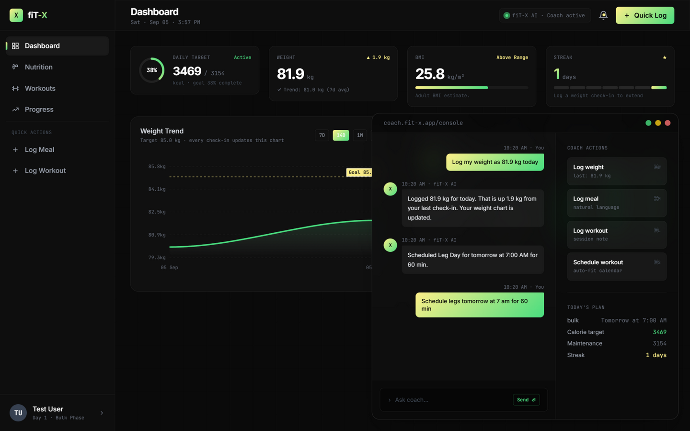
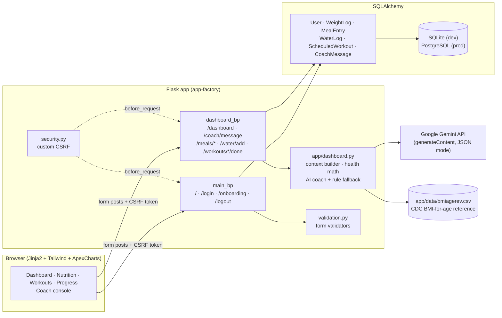

<div align="center">

# fiT-X

**An AI-coached fitness tracker that understands natural language.**

Log meals, weight, water, and any workout — gym, running, yoga, boxing, pilates — by typing
plain sentences. fiT-X parses them with Google Gemini, keeps the score, and shows it all in a
dark, app-like dashboard.

[](https://www.python.org/)
[](https://flask.palletsprojects.com/)
[](https://www.sqlalchemy.org/)
[](https://ai.google.dev/)
[](https://tailwindcss.com/)
[](https://render.com/)
[](#contributing)

[Features](#features) · [Architecture](#architecture) · [Installation](#installation) · [Configuration](#configuration) · [API](#api-documentation) · [Roadmap](#roadmap)

</div>

---

## Screenshots

| Dashboard | Nutrition |
|---|---|
|  |  |

| Workouts | Progress |
|---|---|
|  |  |

<details>
<summary><strong>More: the AI coach console (desktop & mobile)</strong></summary>

| Desktop console | Mobile console |
|---|---|
|  |  |

</details>

---

## Why fiT-X

Most fitness trackers make you fill five fields to log a meal. fiT-X is built around one idea:

> **Type it the way you'd say it. The coach does the rest.**

- *"had two rotis with paneer curry for dinner, pretty oily"* → logged as Dinner, ~602 kcal, 20P/45C/38F (estimated by the AI)
- *"just came back from a 5k run, took me about 28 minutes, easy pace"* → logged as a completed 5k Run, 28 min, ~380 kcal burned
- *"schedule yoga tomorrow at 7 am for 60 min"* → appears on your weekly plan

And unlike most gym apps, fiT-X has **no gym assumption**: a session is *activity + duration +
date*. Yoga, running, combat sports, pilates, and weightlifting all count equally.

---

## Features

<table>
<tr>
<td width="50%" valign="top">

### 📊 Dashboard
- **Today's intake ring** — food logged vs. your calorie target, live
- **Weight card** — current weight, delta vs. last check-in, 7-day average
- **BMI card** — adult BMI, or CDC age-adjusted percentiles for teens
- **Streak** — consecutive days of weight check-ins
- **Weight trend chart** — real check-ins with 7D / 14D / 1M / All ranges and a goal line
- **Today's Plan** — your next scheduled session
- **Weekly Activity** — planned minutes per day

</td>
<td width="50%" valign="top">

### 🍽️ Nutrition
- **Meal cards** for breakfast / lunch / dinner / snacks with per-entry kcal + macros
- **Add Food modal** — name, calories, and macros (kcal computed from macros as 4/4/9 if omitted)
- **Macro distribution donut** — today's real P/C/F
- **Weekly calorie net** — logged intake vs. daily target, per day
- **Macro targets** — computed from body weight (1.8 g/kg protein, 0.9 g/kg fat, carbs fill the rest)
- **Hydration** — persisted water log with +250 / +500 / 1 L quick buttons

</td>
</tr>
<tr>
<td width="50%" valign="top">

### 🏋️ Workouts
- **Activity-agnostic sessions** — any sport or discipline counts
- **Week strip** — 7-day view of scheduled sessions and rest days
- **Mark done** — one click, or tell the coach
- **Recent sessions** — completed history with estimated calories burned
- **This Week** — sessions done, active minutes, estimated burn

</td>
<td width="50%" valign="top">

### 📈 Progress
- **Weight trend** — every check-in vs. your goal weight
- **Direction-independent goal progress** — cut or gain, moving toward the target counts up; moving away counts down (no fake progress)
- **Weekly active minutes** — last 8 weeks of completed sessions
- **Adherence heatmap** — 12 weeks, built from real log dates

</td>
</tr>
<tr>
<td colspan="2" valign="top">

### 🤖 The fiT-X Coach (AI)
- Floating console on every screen — near full-screen on mobile
- Natural-language logging for **weight, meals (with kcal/macros), water, and workouts** — the AI estimates missing values like calories and burn from your body weight, duration, and intensity
- Conversational: ask *"how am i doing today?"* and it answers from your real data
- Every reply is persisted; quick-action buttons prefill common phrases
- **Never breaks**: if the AI is unreachable or no key is configured, a built-in rule-based parser takes over automatically

</td>
</tr>
</table>

---

## Architecture

Single-process, server-rendered Flask — no SPA, no build step. The browser talks to Flask;
Flask talks to Gemini and to SQLAlchemy.



### One file for the whole dashboard

Everything the app screen needs lives in **`app/dashboard.py`**: the context builder, the health
math (EER calorie targets, BMI), the AI coach, and its routes. `app/routes.py` stays auth-only.

| Module | Responsibility |
|---|---|
| `app/__init__.py` | App factory: extensions, CSRF hook, blueprints, schema bootstrap |
| `app/routes.py` | Homepage, sign in/up, onboarding, logout |
| `app/dashboard.py` | Dashboard context, BMI/EER math, AI coach (Gemini) + rule fallback, meal/water/workout routes |
| `app/models.py` | `User`, `WeightLog`, `MealEntry`, `WaterLog`, `ScheduledWorkout`, `CoachMessage` |
| `app/security.py` | Session-based CSRF tokens (`secrets.compare_digest`) |
| `app/validation.py` | Signup / login / onboarding form validation |
| `templates/` | Server-rendered Jinja2 (dark fiT-X design system) |

---

## Installation

**Prerequisites:** Python 3.11+, and a [Google AI Studio](https://aistudio.google.com/) API key for the AI coach (optional — see fallback below).

```bash
# 1. Clone
git clone https://github.com/syncmee/fit-x.git
cd fit-x

# 2. Virtual environment
python -m venv .venv
source .venv/bin/activate        # Windows: .venv\Scripts\activate

# 3. Dependencies
pip install -r requirements.txt

# 4. Configuration (see table below)
cp .env.example .env             # then edit .env

# 5. Run — tables are created automatically on first start
python main.py                   # → http://127.0.0.1:5000
```

Sign up, complete onboarding (sex, age, height, weight, target weight, activity level, goal),
and your dashboard is fully populated — every number on it derives from your profile and logs.

---

## Configuration

All configuration is environment-driven via `.env` (loaded by `python-dotenv`):

| Variable | Required | Default | Description |
|---|---|---|---|
| `GEMINI_API_KEY` | for the AI coach | `""` | Google AI Studio key. Leave empty to use the rule-based coach only |
| `GEMINI_MODEL` | no | `gemini-3.5-flash-lite` | Any Gemini model with `generateContent` support |
| `SMTP_USER` + `SMTP_APP_PASSWORD` | preferred sender | `""` | Gmail (or any SMTP) account for reminder emails. Gmail needs 2-Step Verification + an App Password |
| `SMTP_HOST` / `SMTP_PORT` | no | `smtp.gmail.com` / `587` | SMTP server; STARTTLS |
| `SMTP_FROM` | no | SMTP user | Display sender address |
| `RESEND_API_KEY` | fallback sender | `""` | [Resend](https://resend.com) key. Used only when SMTP is not configured; dry-run if neither is set |
| `RESEND_FROM` | no | `fiT-X <onboarding@resend.dev>` | From address; use a verified domain for real deliveries |
| `CRON_SECRET` | for email reminders | `""` | Shared secret required by `GET /cron/send-reminders` (matched by the scheduled GitHub Action) |
| `SECRET_KEY` | yes in prod | `dev-secret-key-change-me` | Flask session signing key |
| `DATABASE_URL` | no | SQLite at `instance/userdata.db` | Set to a PostgreSQL URL in production |
| `FLASK_ENV` | no | `development` | `production` enables secure session cookies |
| `SESSION_COOKIE_SAMESITE` | no | `Lax` | Session cookie SameSite policy |

> Database tables are created automatically on startup (`create_all`), and new columns ship as
> guarded `ALTER TABLE` statements — first run needs no manual migration step.

---

## Usage

### The user flow

1. **Sign up** → you land on onboarding
2. **Onboarding** captures sex, age, height, weight, target weight, activity level, and goal
   (cut / maintain / bulk) — this drives your age-aware EER calorie target and BMI
3. **Log things** — via the coach console, or the Add Food modal and water buttons
4. **Watch the dashboard fill itself** — intake ring, weight trend, macro split, activity minutes

### Talking to the coach

The coach accepts free-form input. Examples that work today:

```text
Log my weight as 82.4 kg today
had two rotis with paneer curry for dinner, pretty oily
log breakfast: oats, whey, banana - 487 kcal 38p 68c 9f
log 500 ml water
schedule yoga tomorrow at 7 am for 60 min
just came back from a 5k run, took me about 28 minutes, easy pace
how am i doing today?
```

For weight check-ins and workout completions, `yesterday` and explicit dates (`2026-04-12`,
`12/04/2026`) are understood. Water accepts glasses, bottles, ml, and litres.

---

## API documentation

All endpoints are server-rendered form posts (no JSON API), protected by session auth
(Flask-Login) and the custom CSRF middleware — every POST must include a `csrf_token` field
(rendered by `{{ csrf_token() }}`).

| Method | Endpoint | Purpose |
|---|---|---|
| `GET` | `/` | Marketing landing page |
| `GET` `POST` | `/login` | Combined sign-in / sign-up |
| `GET` `POST` | `/onboarding` | Profile capture (login required) |
| `GET` | `/dashboard` | The app screen (login required) |
| `POST` | `/coach/message` | Coach chat: `message` (text, required) |
| `POST` | `/meals/add` | Log food: `name`, `meal_type`, `calories`, `protein`, `carbs`, `fats` |
| `POST` | `/meals/<id>/delete` | Remove a meal entry |
| `POST` | `/water/add` | Log water: `amount_ml` |
| `POST` | `/workouts/<id>/done` | Mark a scheduled session completed |
| `GET` | `/logout` | End session |

### The coach contract

`POST /coach/message` sends the user's text to Gemini with a system prompt containing the
user's live profile and today's totals. The model must answer in strict JSON:

```json
{
  "reply": "Great job on the 5k run! Logged 28 minutes — estimated burn ~380 kcal.",
  "actions": [
    {
      "type": "complete_workout",
      "title": "5k Run",
      "days_ago": 0,
      "duration_minutes": 28,
      "calories_burned": 380
    }
  ]
}
```

Supported action types and fields:

| Action | Fields | Notes |
|---|---|---|
| `log_weight` | `weight_kg`, `days_ago` | 30–350 kg; syncs current weight |
| `log_meal` | `name`, `meal_type`, `calories`, `protein`, `carbs`, `fats` | kcal computed from macros (4/4/9) if omitted |
| `log_water` | `amount_ml` | 100–5000 ml |
| `schedule_workout` | `title`, `days_ahead`, `time_24h`, `duration_minutes`, `calories_burned` | Any activity; past times shift to tomorrow |
| `complete_workout` | `title`, `days_ago`, `duration_minutes`, `calories_burned` | Burn estimated from weight × duration × intensity |

All action values are clamped server-side before touching the database, unknown action types
are skipped, and the model is instructed to *ask* rather than invent when required values are
missing.

### Health math (offline, no API)

- **Calorie target** — Estimated Energy Requirement (EER) equations from the National Academies,
  with dedicated coefficient tables for adults and teens, adjusted by goal (a gentle deficit for
  cut, a steady surplus for bulk, and gentler pacing for users under 19)
- **BMI** — adult BMI, or CDC age-and-sex-adjusted percentiles from
  [`app/data/bmiagerev.csv`](app/data/bmiagerev.csv) for users under 20

---

## Deployment

The app ships with a `Procfile` for [Render](https://render.com) (works on any host that
understands Procfiles):

```bash
web: gunicorn main:app --bind 0.0.0.0:$PORT
```

1. Create a Render Web Service from this repo
2. Add the environment variables from the [configuration table](#configuration) — set
   `DATABASE_URL` to a managed PostgreSQL instance and a strong `SECRET_KEY`, set
   `FLASK_ENV=production`
3. Deploy — schema bootstrap happens on first boot

---

## Roadmap

- [ ] **Body measurements** — waist, chest, arms, body-fat tracking (the Progress card is scaffolded as "coming soon")
- [ ] **Editable settings** — persist biometrics, goals, and macro overrides from the settings modal (currently read-only views of your profile)
- [ ] **Meal database & search** — food lookup with per-100 g nutrition instead of manual kcal entry
- [ ] **Alembic migrations** — replace guarded `ALTER TABLE` statements with versioned migrations
- [ ] **Device integrations** — Apple Health / Google Fit / Oura sync (the settings UI is scaffolded)
- [ ] **Imperial units** — lb / ft / in display alongside metric

---

## Contributing

Issues and PRs are welcome. Please keep the existing architecture in mind:

- Server-rendered Flask + Jinja2 — no SPA frameworks
- Dashboard logic belongs in `app/dashboard.py`; auth stays in `app/routes.py`
- Never commit real credentials — `.env` is gitignored (note: the dev SQLite database is currently tracked in git; this is slated to change, so don't rely on it for storage)

---

<div align="center">
<sub>Built with Flask, Gemini, and a dark theme · fiT-X</sub>
</div>
