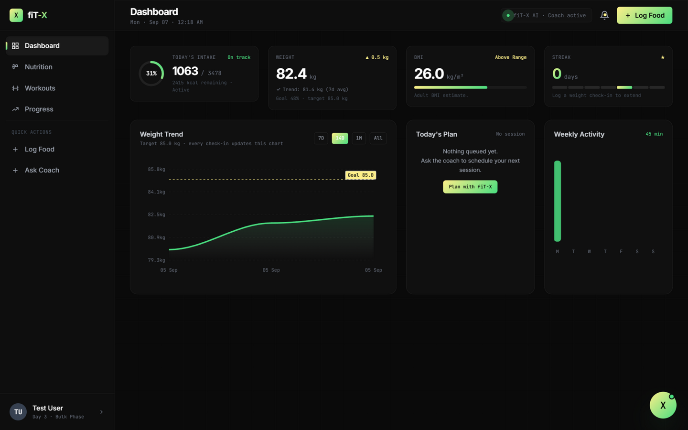
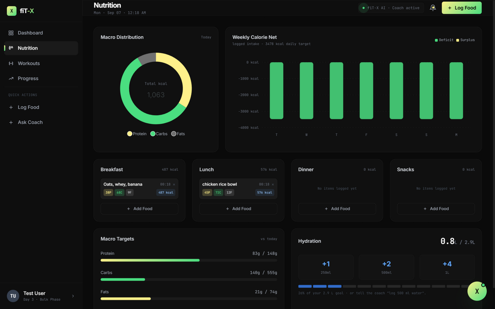
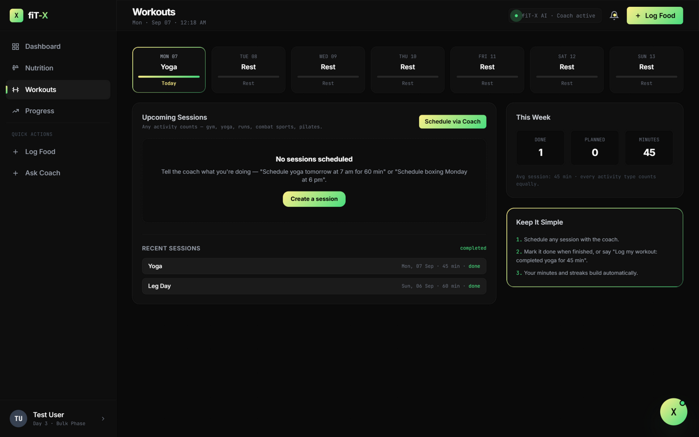
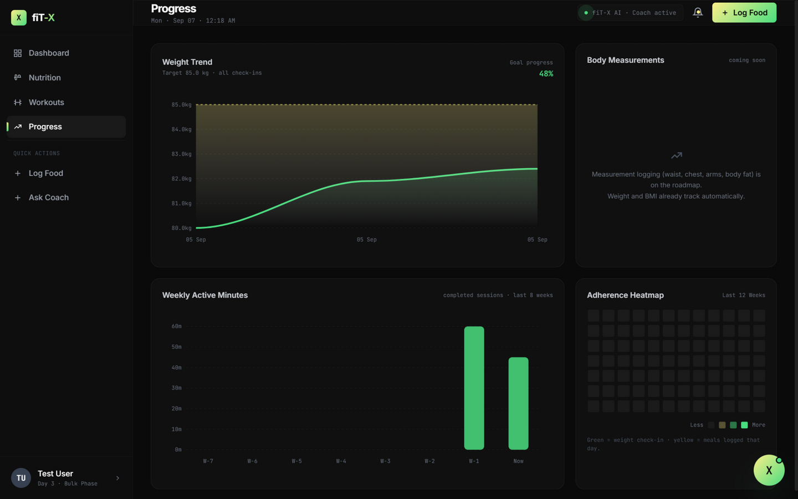
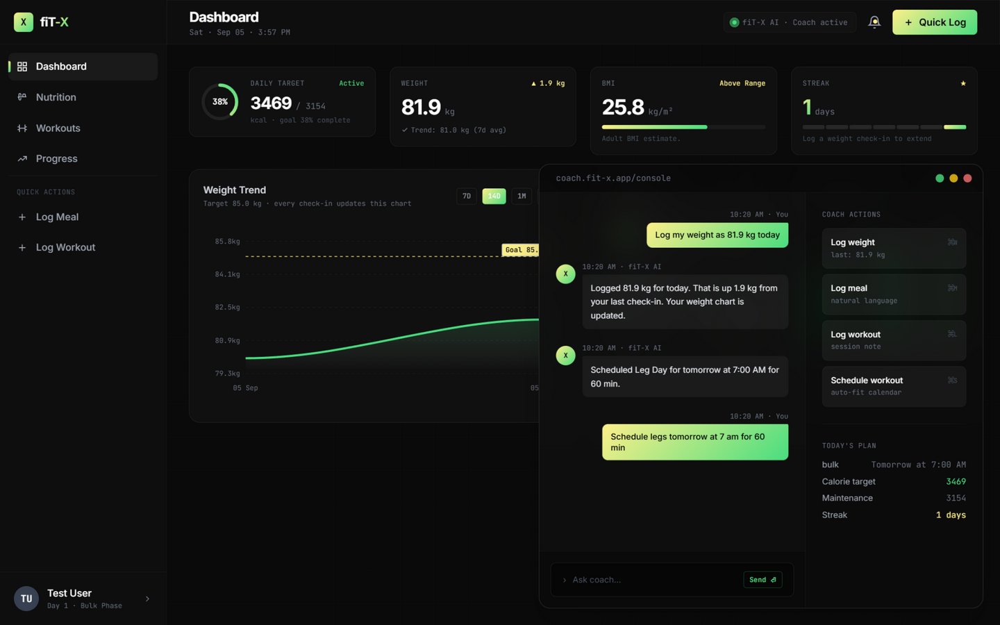
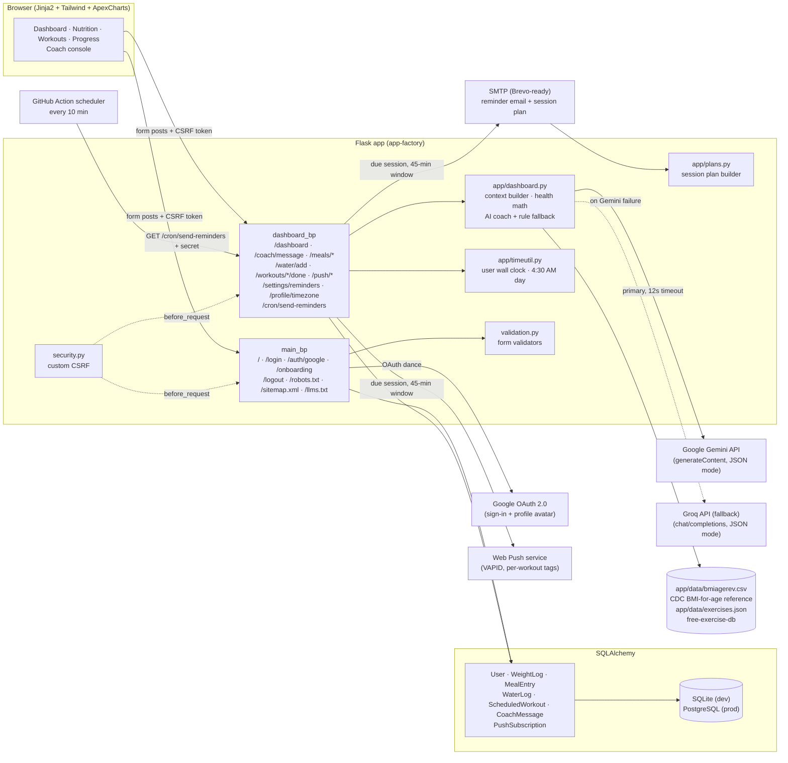

<div align="center">

# fiT-X

**An AI-coached fitness tracker that understands natural language.**

Log meals, weight, water, and any workout — gym, running, yoga, boxing, pilates — by typing
plain sentences. fiT-X parses them with Google Gemini (Groq stands by as an automatic
fallback), keeps the score, and shows it all in a dark, app-like dashboard. Install it to
your home screen as a PWA, sign in with Google or email, and let it nudge you before every
session — web push and email reminders included.

[](https://www.python.org/)
[](https://flask.palletsprojects.com/)
[](https://www.sqlalchemy.org/)
[](https://ai.google.dev/)
[](https://tailwindcss.com/)
[](https://render.com/)
[](#contributing)

[Features](#features) · [Architecture](#architecture) · [Installation](#installation) · [Configuration](#configuration) · [API](#api-documentation) · [Roadmap](#roadmap)

</div>

---

## Screenshots

| Dashboard | Nutrition |
|---|---|
|  |  |

| Workouts | Progress |
|---|---|
|  |  |

<details>
<summary><strong>More: the AI coach console (desktop & mobile)</strong></summary>

| Desktop console | Mobile console |
|---|---|
|  |  |

</details>

---

## Why fiT-X

Most fitness trackers make you fill five fields to log a meal. fiT-X is built around one idea:

> **Type it the way you'd say it. The coach does the rest.**

- *"had two rotis with paneer curry for dinner, pretty oily"* → logged as Dinner, ~602 kcal, 20P/45C/38F (estimated by the AI)
- *"just came back from a 5k run, took me about 28 minutes, easy pace"* → logged as a completed 5k Run, 28 min, ~380 kcal burned
- *"schedule yoga tomorrow at 7 am for 60 min"* → appears on your weekly plan

And unlike most gym apps, fiT-X has **no gym assumption**: a session is *activity + duration +
date*. Yoga, running, combat sports, pilates, and weightlifting all count equally.

---

## Features

<table>
<tr>
<td width="50%" valign="top">

### 📊 Dashboard
- **Today's intake ring** — food logged vs. your calorie target, live
- **Weight card** — current weight, delta vs. last check-in, 7-day average
- **BMI card** — adult BMI, or CDC age-adjusted percentiles for teens
- **Streak** — consecutive days of weight check-ins
- **Weight trend chart** — real check-ins with 7D / 14D / 1M / All ranges and a goal line
- **Today's Plan** — your next scheduled session
- **Weekly Activity** — planned minutes per day
- **Your timezone, your day** — every timestamp is your local wall clock, and the fiT-X day rolls over at 4:30 AM, so a 1 AM snack still counts for the evening before

</td>
<td width="50%" valign="top">

### 🍽️ Nutrition
- **Meal cards** for breakfast / lunch / dinner / snacks with per-entry kcal + macros
- **Add Food modal** — name, calories, and macros (kcal computed from macros as 4/4/9 if omitted)
- **Macro distribution donut** — today's real P/C/F
- **Weekly calorie net** — logged intake vs. daily target, per day
- **Macro targets** — computed from body weight (1.8 g/kg protein, 0.9 g/kg fat, carbs fill the rest)
- **Hydration** — persisted water log with +250 / +500 / 1 L quick buttons

</td>
</tr>
<tr>
<td width="50%" valign="top">

### 🏋️ Workouts
- **Activity-agnostic sessions** — any sport or discipline counts
- **Week strip** — 7-day view of scheduled sessions and rest days
- **Mark done** — one click, or tell the coach
- **Recent sessions** — completed history with estimated calories burned
- **This Week** — sessions done, active minutes, estimated burn

</td>
<td width="50%" valign="top">

### 📈 Progress
- **Weight trend** — every check-in vs. your goal weight
- **Direction-independent goal progress** — cut or gain, moving toward the target counts up; moving away counts down (no fake progress)
- **Weekly active minutes** — last 8 weeks of completed sessions
- **Adherence heatmap** — 12 weeks, built from real log dates

</td>
</tr>
<tr>
<td width="50%" valign="top">

### 🔔 Reminders
- **Web push** — subscribe once from the dashboard bell; every session sends its own tagged notification, so back-to-back workouts never collapse into one
- **Email reminders** — sent up to 45 minutes before start, with a structured session plan attached for gym titles (warm-up, muscle-group blocks, cool-down, from the bundled free-exercise-db dataset)
- **Fully scheduled** — a GitHub Action pings `/cron/send-reminders` every 10 minutes; a per-workout stamp means nothing ever sends twice
- **Opt-in per channel** — email and push each have their own toggle in settings

</td>
<td width="50%" valign="top">

### 📱 PWA & accounts
- **Installable** — full web app manifest with maskable icons and app shortcuts; per-platform install steps on mobile
- **Standalone launch** — branded loading screen on home-screen opens, offline fallback page, service worker registered on every route
- **Sign in with Google** — verified emails only; linking a Google identity to an existing account keeps all its data
- **Discoverable & legal** — Open Graph previews, JSON-LD, sitemap, robots.txt, llms.txt, privacy policy, and terms pages

</td>
</tr>
<tr>
<td colspan="2" valign="top">

### 🤖 The fiT-X Coach (AI)
- Floating console on every screen — near full-screen on mobile
- Natural-language logging for **weight, meals (with kcal/macros), water, and workouts** — the AI estimates missing values like calories and burn from your body weight, duration, and intensity
- Conversational: ask *"how am i doing today?"* and it answers from your real data; it reads your recent turns, so short follow-ups work
- Every reply is persisted; quick-action buttons prefill common phrases
- **Never breaks**: if the AI is unreachable or no key is configured, a built-in rule-based parser takes over automatically — it logs the same things and also answers schedule and progress questions

</td>
</tr>
</table>

---

## Architecture

Single-process, server-rendered Flask — no SPA, no build step. The browser talks to Flask;
Flask talks to Gemini (Groq as fallback), SQLAlchemy, and the health-math CSVs.


```mermaid
flowchart LR
    subgraph Browser["Browser (Jinja2 + Tailwind + ApexCharts)"]
        UI["Dashboard · Nutrition · Workouts · Progress<br/>Coach console"]
    end

    subgraph Flask["Flask app (app-factory)"]
        BP1["main_bp<br/>/ · /login · /auth/google · /onboarding<br/>/logout · /robots.txt · /sitemap.xml · /llms.txt"]
        BP2["dashboard_bp<br/>/dashboard · /coach/message · /meals/*<br/>/water/add · /workouts/*/done · /push/*<br/>/settings/reminders · /profile/timezone<br/>/cron/send-reminders"]
        CORE["app/dashboard.py<br/>context builder · health math<br/>AI coach + rule fallback"]
        PLANS["app/plans.py<br/>session plan builder"]
        TIME["app/timeutil.py<br/>user wall clock · 4:30 AM day"]
        SEC["security.py<br/>custom CSRF"]
        VAL["validation.py<br/>form validators"]
    end

    subgraph Data["SQLAlchemy"]
        DB[("SQLite (dev)<br/>PostgreSQL (prod)")]
        MODELS["User · WeightLog · MealEntry<br/>WaterLog · ScheduledWorkout · CoachMessage<br/>PushSubscription"]
    end

    GEMINI["Google Gemini API<br/>(generateContent, JSON mode)"]
    GROQ["Groq API (fallback)<br/>(chat/completions, JSON mode)"]
    GOAUTH["Google OAuth 2.0<br/>(sign-in + profile avatar)"]
    SMTP["SMTP (Brevo-ready)<br/>reminder email + session plan"]
    PUSH["Web Push service<br/>(VAPID, per-workout tags)"]
    CRON["GitHub Action scheduler<br/>every 10 min"]
    CSV[("app/data/bmiagerev.csv<br/>CDC BMI-for-age reference<br/>app/data/exercises.json<br/>free-exercise-db")]

    UI -->|form posts + CSRF token| BP1
    UI -->|form posts + CSRF token| BP2
    BP1 --> VAL
    BP1 -->|OAuth dance| GOAUTH
    BP2 --> CORE
    BP2 --> TIME
    CORE -->|primary, 12s timeout| GEMINI
    CORE -.->|on Gemini failure| GROQ
    CORE --> CSV
    CRON -->|GET /cron/send-reminders + secret| BP2
    BP2 -->|due session, 45-min window| SMTP
    BP2 -->|due session, 45-min window| PUSH
    SMTP --> PLANS
    BP1 --> MODELS
    BP2 --> MODELS
    MODELS --> DB
    SEC -.->|before_request| BP1
    SEC -.->|before_request| BP2
```

### One file for the whole dashboard

Everything the app screen needs lives in **`app/dashboard.py`**: the context builder, the health
math (EER calorie targets, BMI), the AI coach, and its routes. `app/routes.py` stays auth-only.

| Module | Responsibility |
|---|---|
| `app/__init__.py` | App factory: extensions, CSRF hook, blueprints, schema bootstrap |
| `app/routes.py` | Homepage, sign in/up, Google sign-in, onboarding, logout, SEO routes |
| `app/dashboard.py` | Dashboard context, BMI/EER math, AI coach (Gemini → Groq fallback) + rule fallback, meal/water/workout routes, push subscription, reminder delivery |
| `app/plans.py` | Maps a workout title to a structured session plan from the bundled free-exercise-db dataset (attached to reminder emails) |
| `app/timeutil.py` | Single home for time: user wall-clock stamps and the 4:30 AM fiT-X day rollover |
| `app/seo.py` | SEO constants: canonical URL, JSON-LD graph, robots.txt, llms.txt, sitemap pages |
| `app/models.py` | `User`, `WeightLog`, `MealEntry`, `WaterLog`, `ScheduledWorkout`, `CoachMessage`, `PushSubscription` |
| `app/security.py` | Session-based CSRF tokens (`secrets.compare_digest`) |
| `app/validation.py` | Signup / login / onboarding form validation |
| `templates/` | Server-rendered Jinja2 (dark fiT-X design system), incl. the reminder email template |
| `static/` | PWA assets: `manifest.json`, `sw.js` (service worker + offline page), `app-install.js`, icon set |

---

## Installation

**Prerequisites:** Python 3.11+, and a [Google AI Studio](https://aistudio.google.com/) API key for the AI coach (optional — see fallback below).

```bash
# 1. Clone
git clone https://github.com/syncmee/fit-x.git
cd fit-x

# 2. Virtual environment
python -m venv .venv
source .venv/bin/activate        # Windows: .venv\Scripts\activate

# 3. Dependencies
pip install -r requirements.txt

# 4. Configuration (see table below)
cp .env.example .env             # then edit .env

# 5. Run — tables are created automatically on first start
python main.py                   # → http://127.0.0.1:5000
```

Sign up, complete onboarding (sex, age, height, weight, target weight, activity level, goal),
and your dashboard is fully populated — every number on it derives from your profile and logs.

---

## Configuration

All configuration is environment-driven via `.env` (loaded by `python-dotenv`):

| Variable | Required | Default | Description |
|---|---|---|---|
| `GEMINI_API_KEY` | for the AI coach | `""` | Google AI Studio key. Primary coach provider — leave empty to fall back to Groq (if set) or the rule-based coach |
| `GEMINI_MODEL` | no | `gemini-3.5-flash-lite` | Any Gemini model with `generateContent` support |
| `GROQ_API_KEY` | no | `""` | [Groq](https://console.groq.com/keys) key used as the AI coach fallback when Gemini fails (overloaded model, quota, outage). Leave empty to skip |
| `GROQ_MODEL` | no | `openai/gpt-oss-120b` | Any Groq chat model with JSON mode |
| `GOOGLE_CLIENT_ID` + `GOOGLE_CLIENT_SECRET` | for Google sign-in | `""` | OAuth client from [Google Cloud credentials](https://console.cloud.google.com/apis/credentials) with `<your-host>/auth/google/callback` as a redirect URI. Empty hides the Google button |
| `SMTP_USER` + `SMTP_APP_PASSWORD` | for email reminders | `""` | SMTP account. [Brevo](https://www.brevo.com) works without a domain (verified sender, 300/day free). Leave `SMTP_USER` empty to run the reminder cron in dry-run mode |
| `SMTP_HOST` / `SMTP_PORT` | no | `smtp.gmail.com` / `587` | Use `smtp-relay.brevo.com` / `2525` on Render (free tier blocks SMTP ports 25/465/587) |
| `SMTP_FROM` | no | SMTP user | Verified sender address shown in the From header |
| `CRON_SECRET` | for email reminders | `""` | Shared secret required by `GET /cron/send-reminders` (sent by the scheduled GitHub Action in `.github/workflows/workout-reminders.yml`) |
| `SITE_URL` | no | `https://fitness-app-b0wl.onrender.com` | Canonical origin for SEO: canonical links, Open Graph, JSON-LD, sitemap. Set it when a custom domain takes over |
| `VAPID_PUBLIC_KEY` + `VAPID_PRIVATE_KEY` | for push notifications | `""` | VAPID identity (base64url P-256) for web push reminders. Empty = the bell's push UI stays hidden |
| `SECRET_KEY` | yes in prod | `dev-secret-key-change-me` | Flask session signing key |
| `DATABASE_URL` | no | SQLite at `instance/userdata.db` | Set to a PostgreSQL URL in production |
| `FLASK_ENV` | no | `development` | `production` enables secure session cookies |
| `SESSION_COOKIE_SAMESITE` | no | `Lax` | Session cookie SameSite policy |

> Database tables are created automatically on startup (`create_all`), and new columns ship as
> guarded `ALTER TABLE` statements — first run needs no manual migration step.

---

## Usage

### The user flow

1. **Sign up** (or **Sign in with Google**) → you land on onboarding
2. **Onboarding** captures sex, age, height, weight, target weight, activity level, and goal
   (cut / maintain / bulk) — this drives your age-aware EER calorie target and BMI; the
   dashboard stays locked until it's done
3. **Log things** — via the coach console, or the Add Food modal and water buttons
4. **Watch the dashboard fill itself** — intake ring, weight trend, macro split, activity minutes
5. **Install it** — accept your browser's install prompt (or use the dashboard install button
   on mobile) and fiT-X runs full-screen from your home screen, with a branded launch screen

### Talking to the coach

The coach accepts free-form input. Examples that work today:

```text
Log my weight as 82.4 kg today
had two rotis with paneer curry for dinner, pretty oily
log breakfast: oats, whey, banana - 487 kcal 38p 68c 9f
log 500 ml water
schedule yoga tomorrow at 7 am for 60 min
just came back from a 5k run, took me about 28 minutes, easy pace
how am i doing today?
```

For weight check-ins and workout completions, `yesterday` and explicit dates (`2026-04-12`,
`12/04/2026`) are understood. Water accepts glasses, bottles, ml, and litres.

### Reminders

fiT-X nudges you before every scheduled session — up to 45 minutes ahead — over web push
(enable once from the dashboard bell), email, or both. Reminder emails for gym titles carry a
structured session plan built from the workout's muscle groups (warm-up, one block per group,
cool-down, with sets/reps per exercise). A scheduled GitHub Action triggers
[`/cron/send-reminders`](.github/workflows/workout-reminders.yml) every 10 minutes; each
workout is stamped once its reminder goes out, so nothing sends twice. Toggles for both
channels live in the settings modal.

---

## API documentation

All endpoints are server-rendered form posts (no JSON API), protected by session auth
(Flask-Login) and the custom CSRF middleware — every POST must include a `csrf_token` field
(rendered by `{{ csrf_token() }}`).

| Method | Endpoint | Purpose |
|---|---|---|
| `GET` | `/` | Marketing landing page (Open Graph, JSON-LD) |
| `GET` | `/robots.txt` `/sitemap.xml` `/llms.txt` | SEO discovery for crawlers and answer engines |
| `GET` | `/privacy-policy` `/terms-and-conditions` | Legal pages (footer links) |
| `GET` `POST` | `/login` | Combined sign-in / sign-up |
| `GET` | `/auth/google` (+ `/auth/google/callback`) | Sign in with Google (OAuth 2.0, verified emails only) |
| `GET` `POST` | `/onboarding` | Profile capture (login required) |
| `GET` | `/dashboard` | The app screen (login required, onboarding completed) |
| `POST` | `/coach/message` | Coach chat: `message` (text, required) |
| `POST` | `/meals/add` | Log food: `name`, `meal_type`, `calories`, `protein`, `carbs`, `fats` |
| `POST` | `/meals/<id>/delete` | Remove a meal entry |
| `POST` | `/water/add` | Log water: `amount_ml` |
| `POST` | `/workouts/<id>/done` | Mark a scheduled session completed |
| `POST` | `/profile/timezone` | Store the browser's UTC offset (all stamps use the user's wall clock) |
| `POST` | `/settings/reminders` | Toggle email reminder opt-in |
| `POST` | `/push/subscribe` | Save a web-push subscription (endpoint + keys from the bell panel) |
| `POST` | `/push/unsubscribe` | Remove a push subscription |
| `GET` | `/cron/send-reminders` | Scheduler entry point: deliver due reminders (requires `CRON_SECRET`) |
| `GET` | `/logout` | End session |

### The coach contract

`POST /coach/message` sends the user's text to the AI coach with a system prompt containing the
user's live profile and today's totals. Providers are tried in order — **Gemini** (12 s timeout,
one quick retry on a 503), then **Groq** if configured, then the built-in rule-based parser —
and each attempt uses the same contract. The model must answer in strict JSON:

```json
{
  "reply": "Great job on the 5k run! Logged 28 minutes — estimated burn ~380 kcal.",
  "actions": [
    {
      "type": "complete_workout",
      "title": "5k Run",
      "days_ago": 0,
      "duration_minutes": 28,
      "calories_burned": 380
    }
  ]
}
```

Supported action types and fields:

| Action | Fields | Notes |
|---|---|---|
| `log_weight` | `weight_kg`, `days_ago` | 30–350 kg; syncs current weight |
| `log_meal` | `name`, `meal_type`, `calories`, `protein`, `carbs`, `fats` | kcal computed from macros (4/4/9) if omitted |
| `log_water` | `amount_ml` | 100–5000 ml |
| `schedule_workout` | `title`, `days_ahead`, `time_24h`, `duration_minutes`, `calories_burned` | Any activity; past times shift to tomorrow |
| `complete_workout` | `title`, `days_ago`, `duration_minutes`, `calories_burned` | Burn estimated from weight × duration × intensity |

All action values are clamped server-side before touching the database, unknown action types
are skipped, and the model estimates calories/macros/burn from its own nutrition knowledge for
any recognizable food or activity (noting the estimate in the reply) — it only asks a
clarifying question when the food or portion is genuinely unclear. Numbers the user provides
always win over estimates.

### Health math (offline, no API)

- **Calorie target** — Estimated Energy Requirement (EER) equations from the National Academies,
  with dedicated coefficient tables for adults and teens, adjusted by goal (a gentle deficit for
  cut, a steady surplus for bulk, and gentler pacing for users under 19)
- **BMI** — adult BMI, or CDC age-and-sex-adjusted percentiles from
  [`app/data/bmiagerev.csv`](app/data/bmiagerev.csv) for users under 20

---

## Deployment

The app ships with a `Procfile` for [Render](https://render.com) (works on any host that
understands Procfiles). Two workers × four threads keep page loads responsive while coach
calls wait on the AI providers, and the raised worker timeout accommodates the coach's
provider failover:

```bash
web: gunicorn main:app --bind 0.0.0.0:$PORT --workers 2 --threads 4 --timeout 120
```

1. Create a Render Web Service from this repo
2. Add the environment variables from the [configuration table](#configuration) — set
   `DATABASE_URL` to a managed PostgreSQL instance and a strong `SECRET_KEY`, set
   `FLASK_ENV=production`
3. Deploy — schema bootstrap happens on first boot
4. For workout reminders: add `FITX_CRON_SECRET` (matching your `CRON_SECRET`) and
   `FITX_APP_URL` as repo secrets so the scheduled GitHub Action can reach the cron endpoint,
   and set `SITE_URL` so canonical links, previews, and the sitemap point at your domain

---

## Roadmap

- [ ] **Body measurements** — waist, chest, arms, body-fat tracking (the Progress card is scaffolded as "coming soon")
- [ ] **Editable settings** — persist biometrics, goals, and macro overrides from the settings modal (the reminder toggles already save; biometrics and goals are still read-only)
- [ ] **Meal database & search** — food lookup with per-100 g nutrition instead of manual kcal entry
- [ ] **Alembic migrations** — replace guarded `ALTER TABLE` statements with versioned migrations
- [ ] **Device integrations** — Apple Health / Google Fit / Oura sync (the settings UI is scaffolded)
- [ ] **Imperial units** — lb / ft / in display alongside metric

---

## Contributing

Issues and PRs are welcome. Please keep the existing architecture in mind:

- Server-rendered Flask + Jinja2 — no SPA frameworks
- Dashboard logic belongs in `app/dashboard.py`; auth stays in `app/routes.py`
- Never commit real credentials — `.env` is gitignored (note: the dev SQLite database is currently tracked in git; this is slated to change, so don't rely on it for storage)

---

<div align="center">
<sub>Built with Flask, Gemini, Groq, and a dark theme · fiT-X</sub>
</div>
